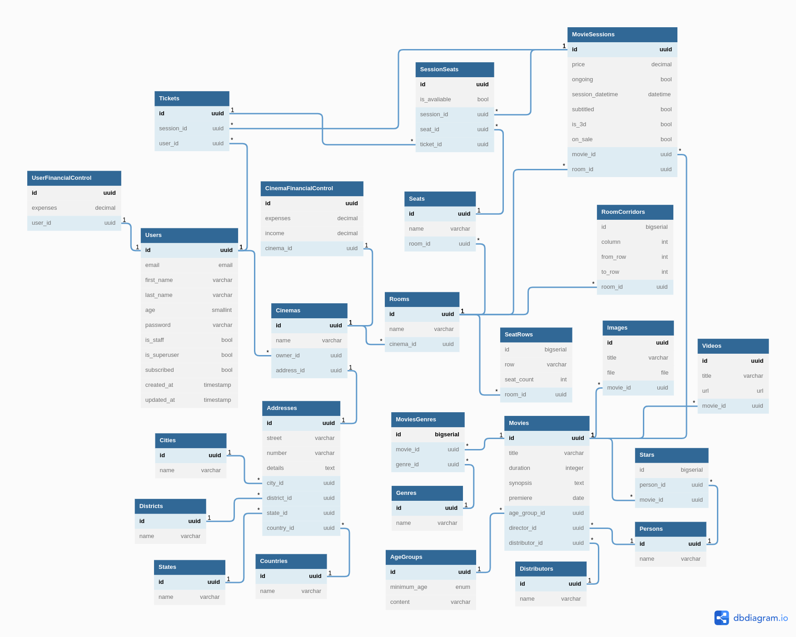

# Documentação da API

## Tabela de Conteúdos

- [Documentação da API](#documentação-da-api)
  - [Tabela de Conteúdos](#tabela-de-conteúdos)
  - [ Voltar para o topo ](#-voltar-para-o-topo-)
- [1 Descrição do projeto](#1-descrição-do-projeto)
    - [Imagine um site onde o usuário pode entrar para ver quais filmes estão passando nos cinemas perto de onde ele mora, e poder ver facilmente qual a programação para os filmes em cada um desses cinemas, além de informações de cada filme, como titulo, sinopse, atores, gênero, etc, além de poder comprar ingressos online. Cada cinema tem ferramentas para controlar as sessões de filme, as salas em que vão passar, o filme a ser passado, os assentos disponíveis e saber quem vai assistir.](#imagine-um-site-onde-o-usuário-pode-entrar-para-ver-quais-filmes-estão-passando-nos-cinemas-perto-de-onde-ele-mora-e-poder-ver-facilmente-qual-a-programação-para-os-filmes-em-cada-um-desses-cinemas-além-de-informações-de-cada-filme-como-titulo-sinopse-atores-gênero-etc-além-de-poder-comprar-ingressos-online-cada-cinema-tem-ferramentas-para-controlar-as-sessões-de-filme-as-salas-em-que-vão-passar-o-filme-a-ser-passado-os-assentos-disponíveis-e-saber-quem-vai-assistir)
- [1.1 Visão Geral](#11-visão-geral)
  - [Visão geral do projeto, tecnologias usadas.](#visão-geral-do-projeto-tecnologias-usadas)
  - [A URL base da aplicação:](#a-url-base-da-aplicação)
    - [http://primeira-fila.herokuapp.com/](#httpprimeira-filaherokuappcom)
  - [ Voltar para o topo ](#-voltar-para-o-topo--1)
- [2. Diagrama e relações](#2-diagrama-e-relações)
  - [Link para acesso ao Diagrama](#link-para-acesso-ao-diagrama)
  - [ Voltar para o topo ](#-voltar-para-o-topo--2)
- [3. Início Rápido](#3-início-rápido)
    - [Clone o projeto em sua máquina e instale as dependências com o comando:](#clone-o-projeto-em-sua-máquina-e-instale-as-dependências-com-o-comando)
  - [ Voltar para o topo ](#-voltar-para-o-topo--3)
- [3.2. Variáveis de Ambiente](#32-variáveis-de-ambiente)
    - [Em seguida, crie um arquivo **.env**, copiando o formato do arquivo **.env.example**:](#em-seguida-crie-um-arquivo-env-copiando-o-formato-do-arquivo-envexample)
    - [Configure suas variáveis de ambiente com suas credenciais](#configure-suas-variáveis-de-ambiente-com-suas-credenciais)
  - [ Voltar para o topo ](#-voltar-para-o-topo--4)
- [3.3. Migrations](#33-migrations)
    - [Execute as migrations com o comando:](#execute-as-migrations-com-o-comando)
  - [ Voltar para o topo ](#-voltar-para-o-topo--5)
- [4. Autenticação e rotas](#4-autenticação-e-rotas)
  - [ Voltar para o topo ](#-voltar-para-o-topo--6)
- [5. Links:](#5-links)
  - [Documentação detalhada das rotas com swagger:](#documentação-detalhada-das-rotas-com-swagger)
  - [Download do arquivo JSON para usar no Insomnia:](#download-do-arquivo-json-para-usar-no-insomnia)
  - [ Voltar para o topo ](#-voltar-para-o-topo--7)

## [ Voltar para o topo ](#tabela-de-conteúdos)

# 1 Descrição do projeto

### Imagine um site onde o usuário pode entrar para ver quais filmes estão passando nos cinemas perto de onde ele mora, e poder ver facilmente qual a programação para os filmes em cada um desses cinemas, além de informações de cada filme, como titulo, sinopse, atores, gênero, etc, além de poder comprar ingressos online. Cada cinema tem ferramentas para controlar as sessões de filme, as salas em que vão passar, o filme a ser passado, os assentos disponíveis e saber quem vai assistir.

# 1.1 Visão Geral

## Visão geral do projeto, tecnologias usadas.

- ### Dependências instaladas na aplicação:
- [Django](https://www.djangoproject.com/)
- [Djangorestframework](https://www.django-rest-framework.org/)
- [Djangorestframework-simplejwt](https://django-rest-framework-simplejwt.readthedocs.io/en/latest/)
- [Black](https://pypi.org/project/black/)
- [Psycopg2-binary](https://pypi.org/project/psycopg2-binary/)
- [Drf-spectacular](https://drf-spectacular.readthedocs.io/en/latest/)
- [Ipdb](https://pypi.org/project/ipdb/)
- [Django-environ](https://django-environ.readthedocs.io/en/latest/)
- [Dj-database-url](https://pypi.org/project/dj-database-url/)
- [Coverage](https://coverage.readthedocs.io/en/6.4.2/)
- ### Ferramentas para a aplicação:
- [Sqlite3](https://www.sqlite.org/index.html)
- [Postgres](https://www.postgresql.org/)
- [Python](https://www.python.org/)
- [Docker](https://www.docker.com/)
- [AWS](https://aws.amazon.com/pt/)
- [Heroku](https://devcenter.heroku.com/categories/reference)

## A URL base da aplicação:

### http://primeira-fila.herokuapp.com/

## [ Voltar para o topo ](#tabela-de-conteúdos)

# 2. Diagrama e relações



## Link para acesso ao Diagrama

- ## https://dbdiagram.io/d/62c6c926cc1bc14cc572f7ea

## [ Voltar para o topo ](#tabela-de-conteúdos)

# 3. Início Rápido

### Clone o projeto em sua máquina e instale as dependências com o comando:

```shell
pip install -r requirements.txt
```

## [ Voltar para o topo ](#tabela-de-conteúdos)

# 3.2. Variáveis de Ambiente

### Em seguida, crie um arquivo **.env**, copiando o formato do arquivo **.env.example**:

```
.env.example .env
```

### Configure suas variáveis de ambiente com suas credenciais

## [ Voltar para o topo ](#tabela-de-conteúdos)

# 3.3. Migrations

### Execute as migrations com o comando:

```
./manage.py migrate
```

## [ Voltar para o topo ](#tabela-de-conteúdos)

# 4. Autenticação e rotas

- ## User:

  - ### `[GET] - /users/self/`
    - ### **(Autenticação de token do(a) usuario/cinefelo("is_staff": False))**
  - ### `[POST] - /users/`
  - ### `[PATCH] - /users/self/`
    - ### **(Autenticação de token do(a) usuario/cinefelo("is_staff": False))**
  - ### `[DELETE] - /users/self/`
    - ### **(Autenticação de token do(a) usuario/cinefelo("is_staff": False))**

- ## Login:

  - ### `[POST] - /sessions/token/`
  - ### `[POST] - /sessions/token/refresh/`

- ## Cinema:

  - ### `[GET] - /cinemas/`
  - ### `[GET] - /cinemas/<cine_id>/movies/<movie_id>/movie-sessions/`
    - ### **(Autenticação de token do(a) gerente/responsável("is_staff": true) do cinema)**
  - ### `[POST] - /cinemas/`
    - ### **(Autenticação de token do(a) gerente/responsável("is_staff": true) do cinema)**
  - ### `[PATCH] - /cinemas/<cine_id>/`
    - ### **(Autenticação de token do(a) gerente/responsável("is_staff": true) do cinema)**
  - ### `[DELETE] - /cinemas/<cine_id>/movie-sessions/<session_id>/tickets/`
    - ### **(Autenticação de token do(a) gerente/responsável("is_staff": true) do cinema)**

- ## Room:

  - ### `[GET] - /cinemas/<cine_id>/rooms/<room_id>/`
  - ### `[GET] - /cinemas/<cine_id>/rooms/`
  - ### `[POST] - /cinemas/<cine_id>/rooms/`
    - ### **(Autenticação de token do(a) gerente/responsável("is_staff": true) do cinema)**
  - ### `[PATCH] - cinemas/<cine_id>/rooms/<room_id>/`
    - ### **(Autenticação de token do(a) gerente/responsável("is_staff": true) do cinema)**
  - ### `[DELETE] - /cinemas/<cine_id>/rooms/<room_id>/`
    - ### **(Autenticação de token do(a) gerente/responsável("is_staff": true) do cinema)**

- ## Movie:

  - ### `[GET] - /movies/<movie_id>/`
  - ### `[GET] - /movies/`
  - ### `[GET] - /movies/all/`
  - ### `[GET] - /cinemas/<cine_id>/movies/`
  - ### `[POST] - /movies/`
    - ### **(Autenticação de token do(a) superuser(ADM))**
  - ### `[PATCH] - /movies/<movie_id>/`
    - ### **(Autenticação de token do(a) superuser(ADM))**
  - ### `[DELETE] - /movies/<movie_id>/`
    - ### **(Autenticação de token do(a) superuser(ADM))**

- ## Movie Session:

  - ### `[GET] - /cinemas/<cine_id>/movie-sessions/<session_id>/`
  - ### `[GET] - /cinemas/<cine_id>/movies/<movie_id>/movie-sessions/`
    - ### **(Autenticação de token do(a) gerente/responsável("is_staff": true) do cinema)**
  - ### `[GET] - /cinemas/<cine_id>/movie-sessions/`
    - ### **(Autenticação de token do(a) gerente/responsável("is_staff": true) do cinema)**
  - ### `[POST] - /cinemas/<cine_id>/rooms/<room_id>/movies/<movie_id>/movie-sessions/`
    - ### **(Autenticação de token do(a) gerente/responsável("is_staff": true) do cinema)**
  - ### `[PATCH] - /cinemas/<cine_id>/movie-sessions/<session_id>/`
    - ### **(Autenticação de token do(a) gerente/responsável("is_staff": true) do cinema)**
  - ### `[DELETE] - /cinemas/<cine_id>/movie-sessions/<session_id>/`
    - ### **(Autenticação de token do(a) gerente/responsável("is_staff": true) do cinema)**

- ## Ticket:

  - ### `[GET] - /cinemas/<cine_id>/movie-sessions/<session_id>/tickets/<ticket_id>/`
    - ### **(Autenticação de token do(a)usuario/cinefelo("is_staff": False)**
  - ### `[GET] - /users/tickets/<ticket_id>/`
    - ### **(Autenticação de token do(a)usuario/cinefelo("is_staff": False)**
  - ### `[GET] - /cinemas/<cine_id>/movie-sessions/<session_id>/tickets/`
    - ### **(Autenticação de token do(a)usuario/cinefelo("is_staff": False)**
  - ### `[POST] - /cinemas/<cine_id>/movie-sessions/<session_id>/tickets/`
    - ### **(Autenticação de token do(a)usuario/cinefelo("is_staff": False)**
  - ### `PATCH - /cinemas/<cine_id>/movie-sessions/<session_id>/tickets/<ticket_id>/`
    - ### **Autenticação de token do(a)usuario/cinefelo("is_staff": False)**

## [ Voltar para o topo ](#tabela-de-conteúdos)

# 5. Links:

## Documentação detalhada das rotas com swagger:

- ### https://primeira-fila.herokuapp.com/docs/

## Download do arquivo JSON para usar no Insomnia:

- ### https://kenzieacademybrasil.slack.com/files/U02AFBZVCMD/F03QG89EQD7/primeira_fila.json

## [ Voltar para o topo ](#tabela-de-conteúdos)
